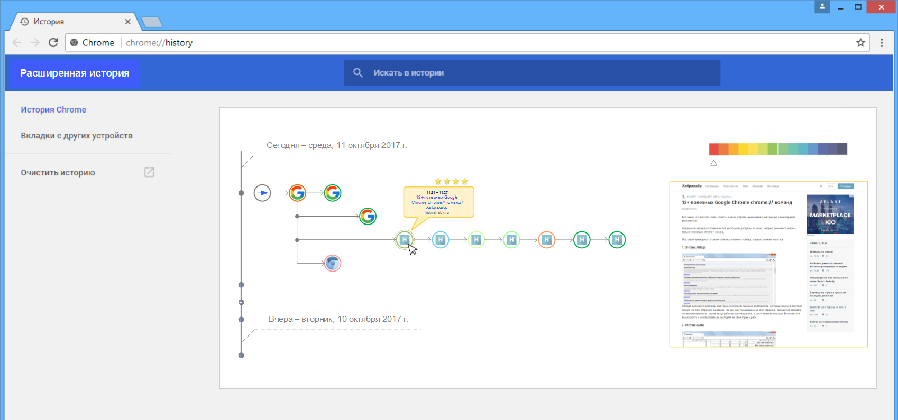
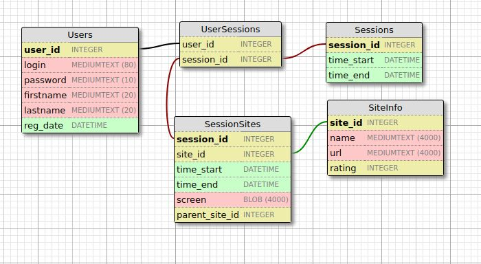

# Материалы BigData 2017
## (AT Consulting и ВГУ, полный осенний курс)  

## Проект №1
### (задание на дом: структура БД в 1нф, 2 нф и 3нф)

[Задание:](./01/%D0%97%D0%B0%D0%B4%D0%B0%D0%BD%D0%B8%D0%B5.txt)

Придумать базу данных (набор таблиц).
Привести их в 1, 2 и 3 нормальные формы.
Пример должен быть достаточно явным.

UPD: [Папка решения](./01/res)

-------

## Трекинг и описание

### 2017-10-11
#### Добавлено решение ззадания на дом
[Задание](./01/%D0%97%D0%B0%D0%B4%D0%B0%D0%BD%D0%B8%D0%B5.txt)

[Описание:](./01/res/Описание.txt)

Как вариант набросал простую схему бд. За основу взял свою идею плагина расширенной истории для chrome, которая давно уже в голове сидит. Нарисовал картинку, там в папке она есть, как все должно выглядеть:

Идея состоит в следующем: регистрируемся в сервисе, и плагин отслеживает активность на сайтах (время пребывания, переходы по ссылкам, сесиии), все логируется в бд на сервер. Затем, при переходе на страницу плагина, отрисовывается полная история в виде отдельных сессий, представленных в виде дерева переходов (см. картинку). Каждый узел содержит иконку сайта и подсвечивается цветом, цвет соответсвует длительности нахождения на этом сайте, справа есть шкала уровня с ползунком, которым можно выбирать степень отображения сайтов (можно, например, выводить только те, на которых были долго, а которые сразу покинули, исключить из дерева). Еще при наведении на узел выводится всплывающая подсказка с информацией о сайте, времени посещения, рейтиге и пр. Кроме того, справа отображается скриншот сайта, сохраненный во время просматриваемой сессии.

Дерево сессий можно сворачивать, удалять узлы и пр. Вообще в идеале еще заметки повесить, пересылку части сесиий (обмен) с пользователями сервиса, сохранение отчетов ну и пр. Но пока самое базовое для бд рассматривал.

Вот для такой задумки нужна бд, сущности - это пользователи, сессии, сайты и вспомогательные сущности информации. Отдельная табличка Users для пользователей (логины, пароли, прочая информация), отдельная табличка для сессий, табличка, связывающая пользователей и сессии (один ко многим), есть табличка для информации о сессии (время начала и конца, но в идеале тут еще различные заметки по сессиям могут быть),  есть табличка, которая хранит информацию о сайтах (без привязки к конкретной сесиии, напрмеир, название, url, может быть рейтинг, который рассчитывается по количеству посещений этого сайта другими пользователями сервиса, другая информация, например, расположение сайта или дата последнего обновления, если что-то такое будет реализовано), а есть еще табличка с информацией о сайте в привязке к конкретной сессии (тут составной ключ id сессии и id сайта) - тут, например, мы можем хранить скриншоты сайта (они могут отличаться у разных пользователей от сесиии к сессии), затем заметки для сайта в привязке к текущей сессии, ссылки на сайты, откуда пришли на этот (на родительские сайты - для построения связей дерева) и пр.
Думаю, это все еще должно дублироваться в SQLite базу помимо удаленного сервера, чтобы не подгружать при каждом запуске из сети.

Там в  [Excel-файле](./01/res/01.xlsx) попытался набросать самую минимальную базу в вариантах от 1нф к 2нф и 3нф.

Структура БД вышла такой:

UPD: [Папка решения](./01/res)

-------