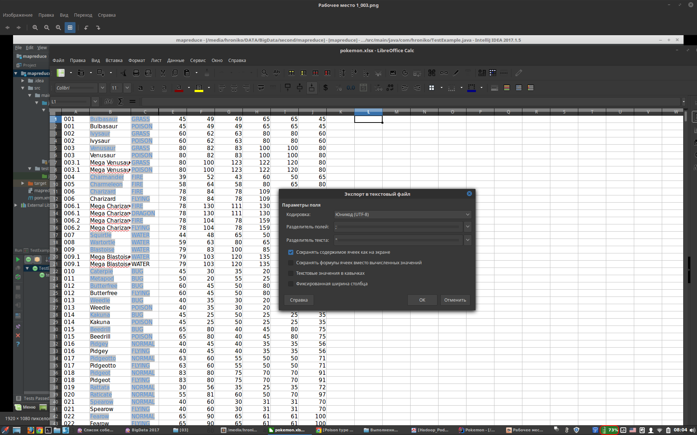

# Материалы BigData 2017
## Проект №3
### (задание на дом: Покемоны и MapReduce)

[Задание:](./03/%D0%97%D0%B0%D0%B4%D0%B0%D0%BD%D0%B8%D0%B5.txt)

Входные данные: Файл [pokemon.xlsx](./03/in/pokemon.xlsx).
Структура полей в файле: number, name, type, hp, attack, defense, special attack, special defense, speed.
Задача: Преобразовать файл из формата xlsx в [файл (csv)](./03/in/pokemon.csv) с разделителем (на ваш выбор). Для каждого типа(type) покемонов вывести имя покемона:
- с самым большим кол-вом HP
- с маленькой атакой
- с высокой защитой
- самого медленного
Выходная структура: type, tank, feeble, defender, slowpoke.

UPD: [Новое решение](./03/project)
UPD: [Старое решение](./03_old/project)
UPD: [Выходной файл](./03/out/out.csv)

-------

## Трекинг и описание

### 2017-10-18 УСТАРЕЛО!!!
#### Добавлено решение Pokemon
[Задание](./03/%D0%97%D0%B0%D0%B4%D0%B0%D0%BD%D0%B8%D0%B5.txt).

Сначала сконвертировал [pokemon.xlsx](./03/in/pokemon.xlsx) в [pokemon.csv](./03/in/pokemon.csv) с разделителем ";". Вот как это выглядит в LibreOffice Calc:

А потом уже делал по аналогии с WordCount.

UPD: [Старое решение](./03_old/project)
UPD: [Выходной файл](./03_old/out/out.csv)

-------

### 2017-10-18
#### Обновил решение Pokemon
[Задание](./03/%D0%97%D0%B0%D0%B4%D0%B0%D0%BD%D0%B8%D0%B5.txt).

Вмсто [старого решения](./03_old/project) со сборкой в мапере всех пой в один Text и последующего сплита в редьюсере, в [новом решении](./03/project) заюзал ArrayWritable, отнаслежовавшись от него в служебном классе textArrayWritable.

UPD: [Новое решение](./03/project)
UPD: [Выходной файл](./03/out/out.csv)

-------