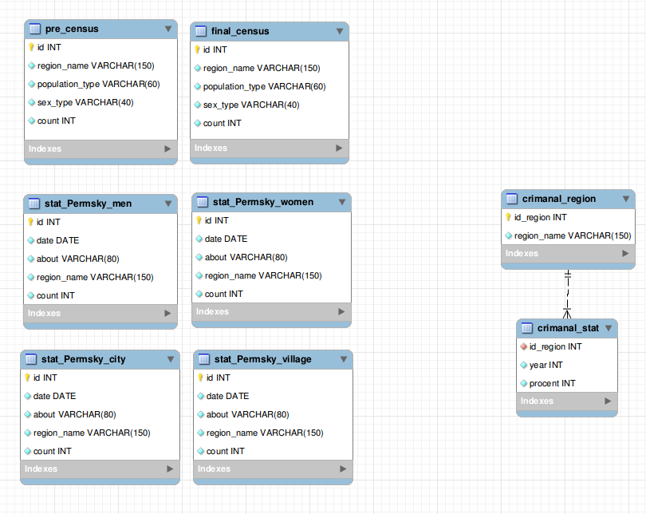
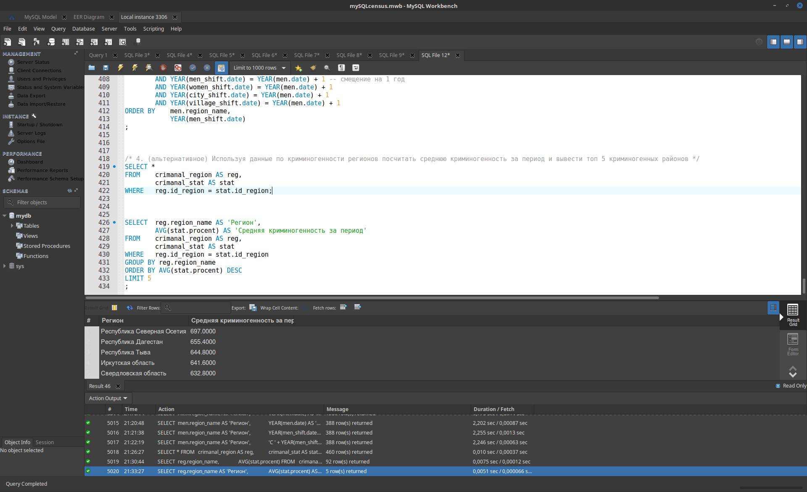

# Материалы BigData 2017
## Проект №9
### (задание на дом: Перепись населения, криминогенность и SQL)

Реализовать [задание](./09/%D0%97%D0%B0%D0%B4%D0%B0%D0%BD%D0%B8%D0%B5.docx) из предыдущей работы на SQL (запросы)

Задания по обработке данных. SQL
Поскольку установка Hive выходит за рамки курса, предлагается реализовать запросы на SQL в одной из распространенных СУБД (MySQL, Oracle и т.д.)
Необходимо на основе данных из предыдущей работы (№8) реализовать таблицы БД и написать запросы, позволяющие получить следующие данные.
1. Используя данные о переписи и предварительной переписи получить:
- Расхождения в значениях между предварительной и финальной переписью
- Посчитать по каждому региону процентное соотношение женщин и мужчин и городского и сельского населения, составить топы 3 по регионам с преобладанием тех или иных критериев(мужчин, женщин, городского, сельского населения)
2. Получить аналогичные данные по Пермскому краю и его субъектам, используя соответствующие данные. Сравнить данные полученые на этом этапе с данными из переписи(Пермский край). Сравнить пермский край со средними значениями по Российской федерации.
3. Посчитать по Пермскому краю естественный прирост населения за каждый год.
- Дополнительно сравнить прирост среди мужчин и женщин. 
- Можно выполнить расчет по районам, в случае затруднений по Перми и по области.
4. (альтернативное) Используя данные по криминогенности регионов посчитать среднюю криминогенность за период и вывести топ 5 криминогенных районов

UPD: [Решение](./09/Result.sql)
UPD: [Скрипт создания БД](./09/script_create.sql)

-------

## Трекинг и описание

### 2017-11-16
#### Добавлено решение Перепись населения, криминогенность и SQL
[Задание:](./09/%D0%97%D0%B0%D0%B4%D0%B0%D0%BD%D0%B8%D0%B5.docx)

В качестве инструмента использовалась СУБД [MySQL Community Edition (GPL)](https://www.mysql.com/) и инструменты:
- [MySQL Community Server 5.7.20](https://dev.mysql.com/downloads/mysql/) - в качестве сервера;
- [MySQL Workbench 6.3.10](https://dev.mysql.com/downloads/workbench/) - в качестве клиента и визуального редактора БД.

Для установки на Linux Mint использовалась инструкция с офф.сайта [MySQL APT Repository](https://dev.mysql.com/downloads/repo/apt/)

Затем в MySQL Workbench в визуальном редакторе была создана структура БД:

После этого плученная [модель](./09/model_mySQL/mySQLcensus.mwb) была экспортирована в СУБД, сформирован [создающий скрипт](./09/script_create.sql), в который были добавлены строки внесения данных в БД. INSERT-команды сформированы в LibreOffice Calc на основе [имеющихся данных](./09/tmp_files_xls/) путем групповой конкатенации командой CONCAT(x;y;...;w) - см. [файл](./09/tmp_files_xls/CONCAT.txt)

Затем настала очередь написания запросов:

UPD: [Решение](./09/Result.sql)
UPD: [Скрипт создания БД](./09/script_create.sql)

-------